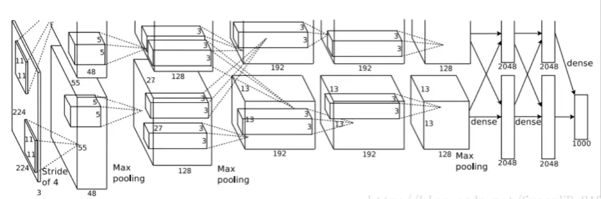
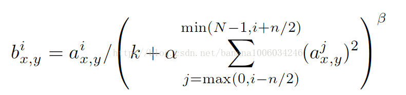

# AlexNet_keras_custom
A practice after reading paper, using cifar10 datasets.

论文名 《ImageNet Classification with Deep Convolutional Neural Networks》

## 网络结构

AlexNet一共7层，不包括输入和输出。

* input, 输入为224x224.
* C1, 96个卷积核，11x11x3，stride=4.
两块GPU分别为55x55x48.
* C2, 256个卷积核，5x5x96.
两块GPU分别为27x27x128.
* C3, 384个卷积核，3x3x256.
两块GPU分别为13x13x192.
* C4, 384个卷积核，3x3x384
两块GPU分别为13x13x192.
* C5, 256个卷积核，3x3x384.
两块GPU分别为13x13x128.
* FC6, 4096个unit.
* FC7, 4096个unit.
* output, 1000个unit.

### 注意
* 2,4,5层只提取各自GPU上的数据.
* 所有的activation均为relu函数，最后的output使用softmax.
* 1,2层后有LRN (Local Response Normalization)操作，1,2,5层后有maxpool操作。所有的maxpool采用交叠池化，即 **3x3, s=2**.
* 每个全连接层后都有dropout操作，参数采取0.5的值.

## 论文分析
1. 非线性单元
之前的网络大多使用的tanh、sigmoid函数作为激活函数，而alexnet采取了relu单元，即$f(x)=max(0,x)$，这有利于减缓深层网络梯度消失的问题，能适当缓解过拟合，加快训练速度。

2. 局部响应归一化 (Local Response Normalization, LRN)
  LRN是一种防止数据过拟合而提出的方法，通常在ReLU层之后进行操作。

  

现在使用LRN的地方不多，因为操作耗时多且性能提升不大。

3. 数据增强
论文中提出了2种数据增强的方式。
* 图片规格处理
原始图像为256x256x3的shape。
在训练时，通过随机裁剪224x224x3的形式来进行对一张图片的多种分割，再将得到的图片进行水平翻转，可以得到更多的训练数据。
在测试时，通过将测试图片以224x224x3的大小在四角和中心进行分割，把测试图片分割为5份，分别代入网络，对最后的预测结果进行求均值，算作最后的预测结果。

* RGB增强
论文中，通过对图像的RGB三通道进行PCA操作来进行通道增强处理。

4. 参数初始化
AlexNet使用SGD作为optimizer，参数如下：
    * batch_size = 128
    * momentum = 0.9
    * decay = 0.0005
对于权重W，采用（0,0.01）的高斯分布初始化。
对于偏差biase，第2,4,5层初始化为1,；其余初始化为0。
learning_rate设置为0.01

# cifar-10
cifar-10共有5个训练集,1个测试集.

原始数据存放在../datasets/cifar10

由于cifar10数据的每个图片的shape为32x32,
~~使用np.pad将图片pad为224x224.~~
使用cv2.resize将图片转为224x224.

# 数据增强
paper中使用了2种数据增强方式,在这里只实现了水平镜像的增强方式,增强RGB通道的方式没有使用.

# 预测
paper中的预测使用了5种随机裁剪的方式,然后对5种预测结果进行求均值的方式.
由于数据集的原因,没有采用裁剪.
